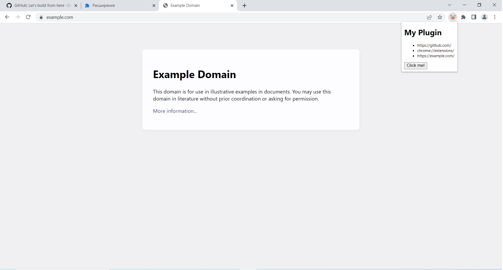

# Google Chrome extension

## Abstract
In this project, I developed a simple Google Chrome extension that prints the URLs of all opened tabs of the browser in the extension HTML window, when the button of the extension is presed. This extension was written in Rust and compiled to WASM to use Rust functions in Javascript module of the extension later. 

I used a `wasm-bindgen` crate to compile functions from Rust module into a wasm file. I also used a `web-sys` crate to get the information about the URLs of all opened tabs of the browser.

## How to run

1. Install [Rust](https://rustup.rs/)
2. Install Wasm-pack
```bash
cargo install wasm-pack
```
3. Run the app
```bash
wasm-pack build --target web
```
4. Open Google Chrome browser and [install the extension](https://support.google.com/chrome_webstore/answer/2664769?hl=en)
5. Press the button to see the URLs in the window

## Example

Here is an example of extension work:


